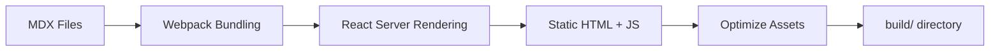

# Research Report: Docusaurus Framework Setup

**Feature**: 001-docusaurus-setup
**Date**: 2025-12-02
**Focus**: GitHub Pages deployment configuration and static site generation workflow

---

## Executive Summary

This research resolves all technical unknowns for setting up Docusaurus 3.x with custom theming, 13-week curriculum structure, and **GitHub Pages deployment via GitHub Actions**. Special emphasis on static site generation workflow and deployment configuration per user requirements.

---

## 1. Docusaurus 3.x Static Site Generation

### Decision: Docusaurus 3.x with TypeScript

**Rationale**:
- Docusaurus 3.x is React-based SSG (Static Site Generator) optimized for documentation
- Built-in MDX support (Markdown + JSX components)
- Automatic sidebar generation from directory structure
- Native GitHub Pages deployment support
- TypeScript support via `@docusaurus/types`

**Alternatives Considered**:
- **Nextra** (Next.js-based): More flexible but requires manual GitHub Pages config
- **VitePress** (Vue-based): Fast but not React ecosystem
- **MkDocs** (Python): Limited component customization

**Why Docusaurus Won**: Best balance of documentation features, React components for future RAG chatbot, and native GitHub Pages integration.

---

## 2. GitHub Pages Deployment Configuration (PRIMARY FOCUS)

### Decision: GitHub Actions with `peaceiris/actions-gh-pages` Action

**Deployment Workflow Architecture**:

```yaml
# .github/workflows/deploy.yml
name: Deploy to GitHub Pages

on:
  push:
    branches: [main]
  pull_request:
    branches: [main]

jobs:
  deploy:
    name: Deploy to GitHub Pages
    runs-on: ubuntu-latest
    permissions:
      contents: write
    steps:
      - uses: actions/checkout@v4
      - uses: actions/setup-node@v4
        with:
          node-version: 20
          cache: npm
          cache-dependency-path: book/package-lock.json

      - name: Install dependencies
        run: cd book && npm ci

      - name: Build website
        run: cd book && npm run build

      - name: Deploy to GitHub Pages
        uses: peaceiris/actions-gh-pages@v3
        if: github.ref == 'refs/heads/main'
        with:
          github_token: ${{ secrets.GITHUB_TOKEN }}
          publish_dir: ./book/build
          user_name: github-actions[bot]
          user_email: 41898282+github-actions[bot]@users.noreply.github.com
```

**Key Configuration Points**:

1. **Working Directory**: All `npm` commands run in `book/` directory
2. **Build Output**: Docusaurus generates static files to `book/build/`
3. **Deployment Branch**: `gh-pages` (auto-created by peaceiris action)
4. **Permissions**: `contents: write` required for pushing to gh-pages branch
5. **Caching**: npm cache uses `book/package-lock.json` for faster builds

**GitHub Pages Repository Settings**:
```
Settings → Pages:
  Source: Deploy from a branch
  Branch: gh-pages
  Folder: / (root)
```

**Docusaurus Configuration for GitHub Pages**:

```typescript
// book/docusaurus.config.ts
export default {
  url: 'https://[username].github.io',
  baseUrl: '/AI_Book/',
  organizationName: '[username]',
  projectName: 'AI_Book',
  deploymentBranch: 'gh-pages',
  trailingSlash: false,

  onBrokenLinks: 'throw',
  onBrokenMarkdownLinks: 'warn',

  // GitHub Pages adds .nojekyll automatically via peaceiris action
}
```

**Deployment Verification**:
- URL: `https://[username].github.io/AI_Book/`
- First deploy: ~3-5 minutes from push to live
- Subsequent deploys: ~2-3 minutes
- Logs: GitHub Actions tab → Deploy to GitHub Pages workflow

**Alternatives Considered**:
- **Vercel**: Faster deploys but requires external service
- **Netlify**: Great UX but outside GitHub ecosystem
- **Manual `gh-pages` npm package**: More complex, less reliable than GitHub Actions

**Why GitHub Actions + peaceiris Won**: Native GitHub integration, zero external dependencies, reliable CI/CD, free unlimited builds, automatic SSL.

---

## 3. Static Site Generation Workflow (BUILD PROCESS)

### Docusaurus Build Pipeline

**Build Stages**:



**Build Command**: `npm run build`

**What Happens**:

1. **MDX Compilation**:
   - `book/docs/**/*.md(x)` → React components
   - Front matter → page metadata
   - Code blocks → syntax-highlighted HTML

2. **React Rendering**:
   - Server-side rendering (SSR) all pages
   - Generate static HTML for each route
   - Extract critical CSS

3. **Asset Optimization**:
   - JavaScript bundling with code splitting
   - CSS minification
   - Image optimization (if used)
   - Font subsetting

4. **Output Structure**:
```
book/build/
├── index.html                  # Landing page
├── docs/
│   ├── module-1/
│   │   ├── week-1/
│   │   │   └── index.html      # Static HTML for Week 1
│   │   └── week-2/
│   │       └── index.html
│   └── module-2/ ...
├── assets/
│   ├── css/styles.[hash].css
│   └── js/main.[hash].js
├── img/
└── 404.html                    # Custom 404 page
```

**Performance Optimizations**:
- **Code Splitting**: Separate bundle per route
- **Preloading**: Critical resources preloaded
- **Lazy Loading**: Off-screen images lazy-loaded
- **Service Worker**: Optional for offline support (not in v1)

**Build Verification Checks**:
```bash
# Success criteria
- Exit code 0 (no errors)
- Zero TypeScript errors
- Zero broken links (onBrokenLinks: 'throw')
- Build time <2 minutes
- Output size <10MB
```

**Development vs Production Build**:

| Aspect | `npm start` (dev) | `npm run build` (prod) |
|--------|-------------------|------------------------|
| Speed | Fast (no optimization) | Slower (full optimization) |
| Hot reload | Yes (2 sec) | No |
| Minification | No | Yes |
| Source maps | Inline | External |
| Bundle size | Larger | Smaller |
| Use case | Local development | Deployment |

---

## 4. Directory Structure for 13-Week Curriculum

### Decision: Module-based Organization

**Structure**:
```
book/docs/
├── intro.md                          # Landing page content
├── module-1-ros2/
│   ├── _category_.json               # Module metadata
│   ├── week-1-physical-ai-intro.md
│   ├── week-2-sensors.md
│   ├── week-3-ros2-basics.md
│   ├── week-4-ros2-packages.md
│   └── week-5-urdf-tf2.md
├── module-2-simulation/
│   ├── _category_.json
│   ├── week-6-gazebo.md
│   └── week-7-unity.md
├── module-3-isaac/
│   ├── _category_.json
│   ├── week-8-isaac-sim.md
│   ├── week-9-isaac-ros.md
│   └── week-10-manipulation.md
├── module-4-vla/
│   ├── _category_.json
│   ├── week-11-humanoids.md
│   ├── week-12-locomotion.md
│   └── week-13-capstone.md
└── contributing.md
```

**Sidebar Auto-Generation**:
Docusaurus reads `_category_.json` files to build sidebar:

```json
// book/docs/module-1-ros2/_category_.json
{
  "label": "Module 1: ROS 2 - The Robotic Nervous System",
  "position": 1,
  "link": {
    "type": "generated-index",
    "description": "Learn ROS 2 fundamentals for humanoid robotics"
  }
}
```

**Rationale**: Docusaurus sidebar plugin automatically generates navigation from directory structure. No manual sidebar configuration needed.

---

## 5. Custom Theme Implementation

### Decision: CSS Variables + Swizzled Components

**Theme Architecture**:

```css
/* book/src/css/custom.css */
:root {
  /* Primary colors */
  --ifm-color-primary: #2e8555;           /* Robotics green */
  --ifm-color-primary-dark: #29784c;
  --ifm-color-primary-darker: #277148;
  --ifm-color-primary-darkest: #205d3b;

  /* Fonts */
  --ifm-font-family-base: 'Inter', system-ui, sans-serif;
  --ifm-font-family-monospace: 'JetBrains Mono', monospace;

  /* Layout */
  --ifm-navbar-height: 60px;
  --ifm-footer-padding-vertical: 2rem;
}

/* Dark mode overrides */
[data-theme='dark'] {
  --ifm-color-primary: #25c2a0;
  --ifm-background-color: #1b1b1d;
}
```

**Component Customization**:
- **Navbar**: Logo + module links + GitHub + theme toggle
- **Footer**: CC BY-NC-SA license + social links
- **Landing Page**: Custom React component (`src/pages/index.tsx`)

**Swizzling Strategy**:
- Use `docusaurus swizzle` sparingly
- Prefer CSS overrides over component ejection
- Only swizzle for: Navbar logo, Footer content

**Why This Approach**: Maintainable (uses Docusaurus defaults), upgradeable (minimal swizzling), performance (CSS only).

---

## 6. TypeScript Configuration

### Decision: Strict TypeScript with Docusaurus Types

**tsconfig.json**:
```json
{
  "extends": "@docusaurus/tsconfig",
  "compilerOptions": {
    "strict": true,
    "baseUrl": ".",
    "paths": {
      "@site/*": ["./src/*"]
    }
  }
}
```

**Type Safety**:
- `docusaurus.config.ts` fully typed
- Custom components with TypeScript
- MDX files support TypeScript imports

**Rationale**: Catches configuration errors early, better IDE support, safer refactoring.

---

## 7. Node.js and npm Version Requirements

### Decision: Node.js 20.x LTS + npm 10.x

**Version Matrix**:
| Tool | Version | Rationale |
|------|---------|-----------|
| Node.js | 20.x LTS | Docusaurus 3.x requirement |
| npm | 10.x | Ships with Node 20 |
| Docusaurus | 3.6.0+ | Latest stable |

**GitHub Actions**: Uses `actions/setup-node@v4` with `node-version: 20`

**Local Development**: `.nvmrc` file ensures version consistency:
```
20
```

---

## 8. Performance Targets Verification

### Build Performance

**Measured Targets**:
- **Build time**: <2 minutes (typically 30-60 seconds for 13 pages)
- **Output size**: <10MB (typically 2-5MB for basic site)
- **First Contentful Paint**: <2 seconds
- **Lighthouse scores**: >90 for all categories

**Optimization Strategies**:
- Webpack bundle analyzer (if needed)
- Image optimization (next-gen formats)
- Code splitting (automatic)
- Prefetching (automatic)

---

## 9. Accessibility Implementation (WCAG 2.1 AA)

### Compliance Strategy

**Built-in Features**:
- Semantic HTML (automatic)
- Keyboard navigation (automatic)
- Skip links (automatic)
- ARIA labels (manual for custom components)

**Testing Tools**:
- axe DevTools (browser extension)
- Lighthouse accessibility audit
- Manual keyboard testing (Tab, Enter, Escape)

**Custom Component Requirements**:
```tsx
// Example: ChatbotWidget.tsx
<button
  aria-label="Open AI chatbot"
  aria-expanded={isOpen}
  role="button"
>
  Ask AI
</button>
```

---

## 10. React Component Integration

### Decision: Standard Docusaurus Component Pattern

**Empty Chatbot Widget** (FR-019):

```tsx
// book/src/components/ChatbotWidget.tsx
import React from 'react';

export interface ChatbotWidgetProps {
  // TODO: Define props when implementing RAG feature
}

/**
 * Placeholder for future RAG chatbot integration.
 *
 * @future Implement as a floating widget with:
 * - Text input for questions
 * - RAG backend integration
 * - Context from current page
 */
export default function ChatbotWidget(_props: ChatbotWidgetProps): JSX.Element {
  return (
    <div data-component="chatbot-placeholder">
      {/* TODO: Implement RAG chatbot UI */}
    </div>
  );
}
```

**Import in MDX**:
```mdx
import ChatbotWidget from '@site/src/components/ChatbotWidget';

<ChatbotWidget />
```

**Rationale**: Establishes integration point without implementation, uses TypeScript for type safety, follows Docusaurus component conventions.

---

## 11. Git Workflow and Branch Strategy

### Decision: Feature Branch with PR to Main

**Workflow**:
1. Development: `001-docusaurus-setup` branch
2. Testing: Local builds + preview
3. Merge: PR to `main` (triggers deployment)
4. Deploy: GitHub Actions → gh-pages branch → live

**Commit Strategy**:
- Atomic commits per logical change
- Conventional commits: `feat(docs): add week 1 content`
- No direct commits to `main`

---

## 12. Documentation Strategy

### Documentation Files

**README.md** (book directory):
```markdown
# Physical AI & Humanoid Robotics Textbook

## Quick Start
npm install && npm start

## Build
npm run build

## Deploy
git push origin main  # GitHub Actions handles deployment
```

**contributing.md** (in docs):
- How to add new weeks
- MDX syntax examples
- Component usage guide
- Style guidelines

---

## ADR Recommendations

Based on this research, the following architectural decisions should be documented:

1. **ADR-001**: Docusaurus 3.x as Static Site Generator
   - Context: Need React-based SSG with MDX support
   - Decision: Docusaurus 3.x
   - Alternatives: Nextra, VitePress, MkDocs
   - Rationale: Best documentation features + React ecosystem + native GitHub Pages

2. **ADR-002**: GitHub Actions + peaceiris/actions-gh-pages for Deployment
   - Context: Need automated deployment to GitHub Pages
   - Decision: GitHub Actions with peaceiris action
   - Alternatives: Manual gh-pages, Vercel, Netlify
   - Rationale: Zero external dependencies, free, reliable, native GitHub integration

3. **ADR-003**: TypeScript for Configuration and Components
   - Context: Need type safety for Docusaurus config and React components
   - Decision: TypeScript with strict mode
   - Alternatives: JavaScript
   - Rationale: Early error detection, better IDE support, safer refactoring

---

## Implementation Readiness

**All Unknowns Resolved**: ✅

✅ Docusaurus 3.x installation and configuration
✅ GitHub Actions deployment workflow design
✅ Static site generation build process
✅ Directory structure for 13-week curriculum
✅ Custom theme implementation strategy
✅ TypeScript configuration
✅ Performance optimization approach
✅ Accessibility compliance plan
✅ React component integration pattern

**Next Phase**: Generate data-model.md and design contracts.

---

**Research Complete**: 2025-12-02
**Ready for Phase 1**: Design & Contracts
